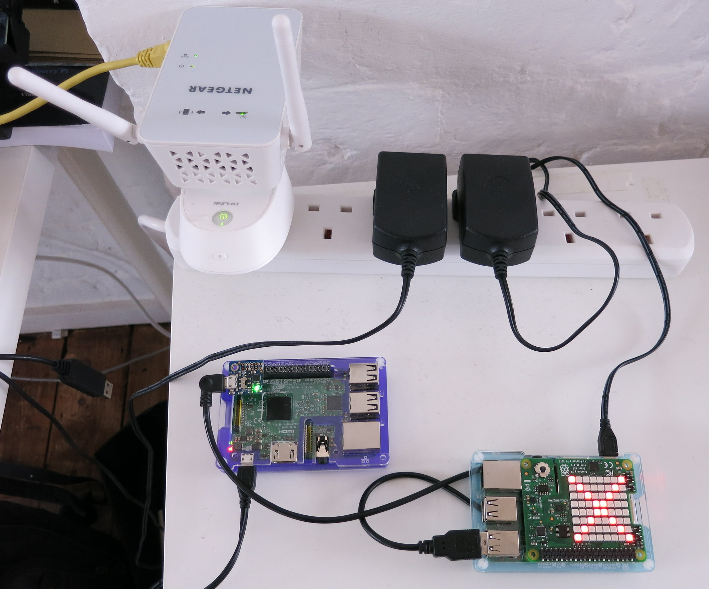
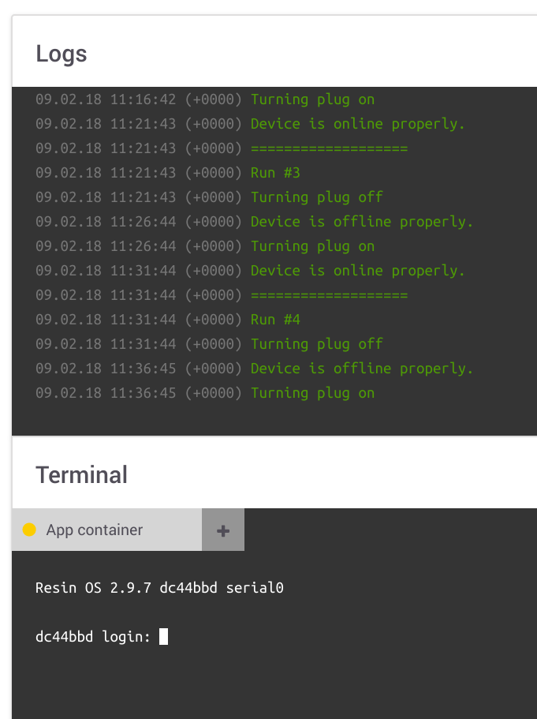
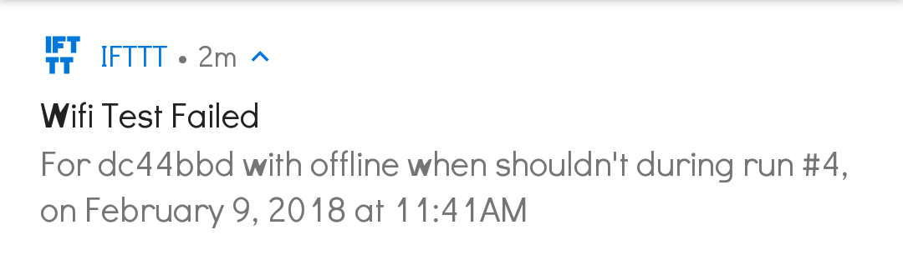

# Wifi Connectivity Test Rig

A wifi connectivity test rig, that automates turning off/on an access point, and tests whether a specific resin device is correctly offline/online as expected.

The master node will repeatedly switch off an access point, after a wait time checks whether the test device is offline, switches the access point back on, and checks whether the device came back online. Optionally a serial connection can be run to the test device, so even if it's offline, it can be manipulated through the master device. Also optionally the node can provide visiual fieedback (if it has SenseHAT hardware), or remote notifications through [IFTTN](https://ifttt.com/).

## Hardware:

*   A master device (running this code), and some device under test (DUT)
*   [TP-Link HS100 smartplug](http://www.tp-link.com/uk/products/details/cat-5258_HS100.html): to turn the access-point on/off
*   Wifi Access Point with Ethernet. I've used [Netgear EX6100](http://www.netgear.co.uk/home/products/networking/wifi-range-extenders/EX6100.aspx) but anything else should be good too
*   USB Serial to connect to the DUT, I've used [PiUART](https://www.adafruit.com/product/3589) since I've tested Raspberry Pis (optional)
*   [SenseHAT](https://www.raspberrypi.org/products/sense-hat/) if the master device is a Pi for easy visual feedback (optional)

## Software Setup:

### Master Device

The master device should probably run the latest ResinOS version (dev/prod doesn't matter). It should be connected to the main network (not to the test access point!), and be on the same network as the smart plug.

### Device Under Test

The DUT should run a target dev version if possible (so that it can be accessed over serial if needed), but that's optional.

It should be set up to connect to the network created by the test access point (powered through the smart plug).

### Application Setup

Environment Variables to set on the test device in the resin.io Dashboard:

*   `AUTH_TOKEN`: a resin.io auth token (from the dashboard, for example), for device offline/online query (required)
*   `PLUG_IP`: the IP address of the smartplug that turns the access point on/off (required); recommended setting static IP for that device on the network
*   `TEST_DEVICE`: the UUID of the device under test (required)
*   `SLEEP_MINS`: number of minutes to sleep between smartplug off or on, and device offline/online query, default is `5` (optional)
*   `SENSEHAT`: set it to any value to enable SenseHAT visual feedback (red cross when failed test, red circle if something else failed along the way)
*   `IFTTT_URL`: the IFTTT webhook URL if want to have notification of test failures

When a test is finished, just restart the application to initiate a new test.

If there's a serial connection to the test device, can peek inside there by connecting to the master node's application container, and using `screen` to connect
over serial, eg. `screen /dev/ttyUSB0 115200`.

### IFTTN Setup (optional)

Create a new applet:

*   If a webhook: set an event name, then check [Webhooks](https://ifttt.com/maker_webhooks), get your request URL from the upper right "Documentation" link, set that as `IFTTT_URL`
*   Then send notification:
    *   Title: anything you like (mine was `Wifi Test Failed`)
    *   Message: fill in the message, with `value1` being the DUT short UUID, `value2` is the failure message, and `value3` is the run number. My setup is `For {{Value1}} with {{Value2}} during run #{{Value3}}, on {{OccurredAt}}`.
    *   Link: optional, can leave it empty, or set it to your master node's resin.io dashboard link for quick access

## License

Copyright 2018 Resinio Ltd.

Licensed under the Apache License, Version 2.0 (the "License");
you may not use this file except in compliance with the License.
You may obtain a copy of the License at

    http://www.apache.org/licenses/LICENSE-2.0

Unless required by applicable law or agreed to in writing, software
distributed under the License is distributed on an "AS IS" BASIS,
WITHOUT WARRANTIES OR CONDITIONS OF ANY KIND, either express or implied.
See the License for the specific language governing permissions and
limitations under the License.
